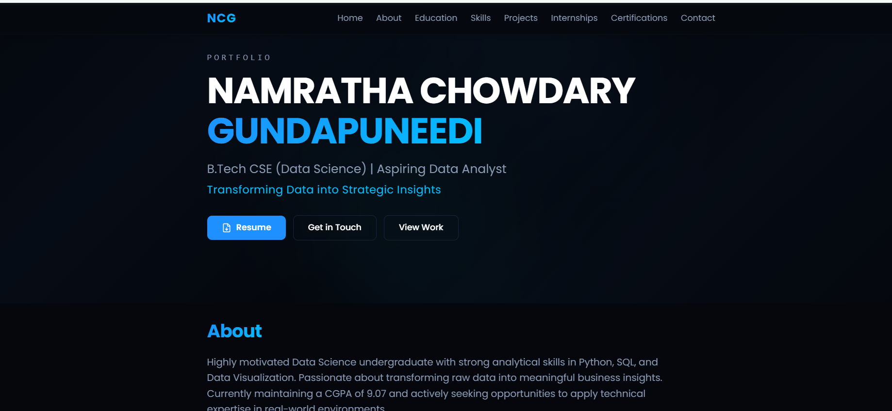

# 🌐 Personal Portfolio Website

Welcome to my personal portfolio website!
This website showcases my **skills, projects, education, internships, and certifications** as an aspiring **Data Analyst**.

---

## 📸 Preview



---

## 🚀 Live Demo

👉 **Portfolio Website:**
https://v0-personal-portfolio-website-ruddy-ten.vercel.app/

---

## 👩‍💻 About Me

I am a **B.Tech Computer Science (Data Science)** student passionate about solving real-world problems using data.
I specialize in **Python, SQL, and Data Visualization** and aim to transform raw data into meaningful insights.

---

## 🛠️ Tech Stack

* **Frontend:** Next.js, TypeScript
* **Styling:** Tailwind CSS
* **Deployment:** Vercel

---

## ✨ Features

* Responsive and modern UI design
* About, Education, Skills, and Projects sections
* Internship and Certification showcase
* Contact form with social links
* Clean navigation and user-friendly layout

---

## 💡 Skills

* **Programming:** Python, Java, C
* **Web:** HTML, CSS, JavaScript, React
* **Data:** SQL, Pandas, NumPy, Matplotlib
* **Tools:** Power BI, Tableau, Excel, Git

---

## 📂 Projects Included

### 🔹 Global Holidays & Travel Trends Dashboard

* Built using Power BI
* Performed data cleaning and preprocessing
* Created visualizations like bar charts, maps, and KPIs
* Extracted insights on travel and holiday patterns

---

## 💼 Internships

* Infosys Springboard Virtual Internship (Data Visualization)
* Python with Machine Learning – AICTE
* Python Full Stack Development – EduSkills

---

## 📜 Certifications

* NPTEL – Joy of Computing Using Python
* Python for Data Science
* Infosys Springboard – Data Visualization
* EduSkills – Full Stack Development

---

## ⚙️ Run Locally

```bash
git clone https://github.com/Namratha1450/v0-personal-portfolio-website.git
cd v0-personal-portfolio-website
npm install
npm run dev
```

---

## 📘 What I Learned

* Building responsive UI using Tailwind CSS
* Structuring scalable frontend using Next.js
* Deploying applications using Vercel
* Creating a professional portfolio for recruiters

---

## 📈 Future Improvements

* Add backend for contact form
* Improve SEO optimization
* Add project filtering feature

---

## 📬 Contact

* 📧 Email: [namrathachowdarygundapuneedi@gmail.com](mailto:namrathachowdarygundapuneedi@gmail.com)
* 🔗 LinkedIn: https://linkedin.com/in/namratha-chowdary-gundapuneedi
* 💻 GitHub: https://github.com/Namratha1450
* 👨‍💻 CodeChef: https://www.codechef.com/users/namratha1450

---

## 🎯 Purpose

This portfolio represents my journey in **Data Analytics** and highlights my technical skills, projects, and practical experience.
It serves as a platform to showcase my work to **recruiters and collaborators**.

---

⭐ If you like my work, feel free to connect with me!
